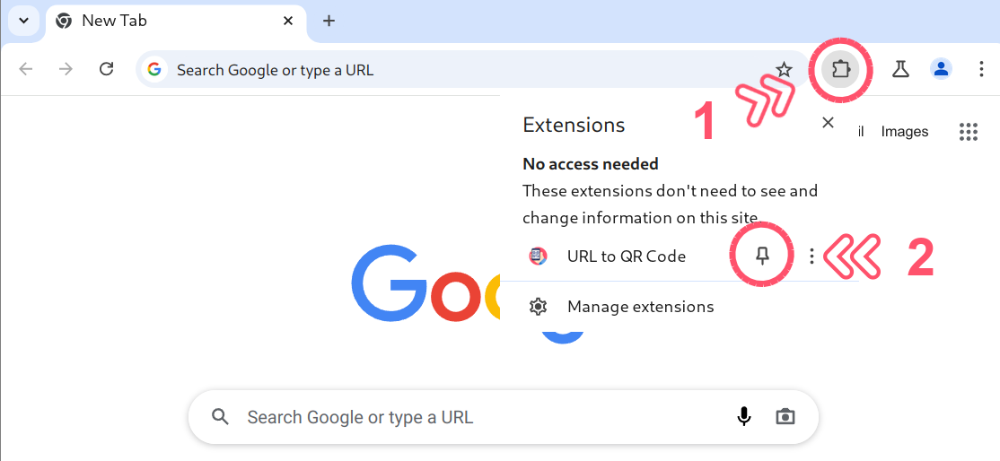
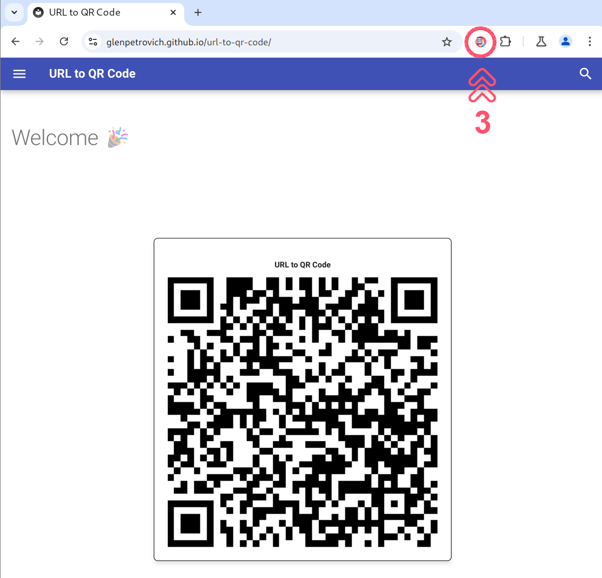
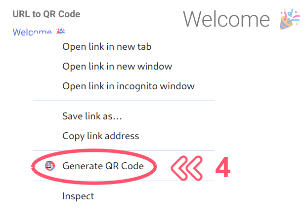

# Welcome 🎉

# Congratulations! The URL to QR Code extension has been installed.

1. Pin the URL to QR Code extension for easy access.
   { align=left }

2. Simply click the extension icon to generate a QR code for the current URL.
   { align=left }

3. You can generate QR code for any link on the page by selecting it from the context menu.
   { align=left }